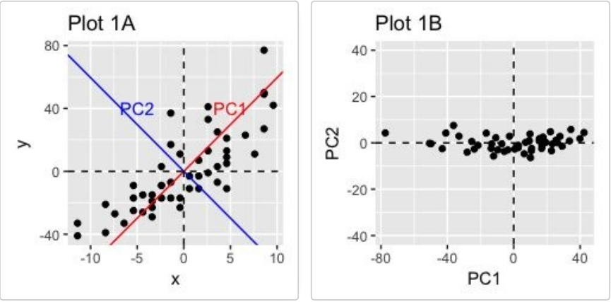

# Appendix


## PCA Analysis

### Motivation

After having an overview of the relationship between the variables of the dataset `decathlon2`, the searcher wants  to extract more information and a better visualization from this correlation structure for both samples and variables. 

```{r}
library(FactoMineR)
library(gplots)
library(factoextra)

data(decathlon2)


data.events <- decathlon2[,c(1:10)]
correlation.pearson <- cor(data.events, method = 'pearson', use = 'complete.obs')
heatmap.2(correlation.pearson, trace = 'none', cexRow = 0.8, cexCol = 0.8, 
          col= colorRampPalette(c("blue","white","red"))(20))

```

To do so we will use the principal components analysis commonly called PCA.

### Working example

We will use the example that we created in the previous section on correlation:

```{r, warning=F}

library(mvtnorm)
set.seed(352)
sample.size <- 60

correlations <- runif(45, -1, 1)
correlation.matrix <- matrix(0, 10, 10)
correlation.matrix[upper.tri(correlation.matrix, diag=FALSE)] <- 
  correlations 
correlation.matrix[lower.tri(correlation.matrix, diag=FALSE)]  <- 
  t(correlation.matrix)[lower.tri(correlation.matrix)]
diag(correlation.matrix) <- 1
standard.deviations <- rep(1,10)
covariance.matrix<- diag(standard.deviations) %*% 
  correlation.matrix %*% 
  diag(standard.deviations)

dataset<-as.data.frame(rmvnorm( sample.size, mean=rep(0,10), covariance.matrix))
colnames(dataset) <- paste('Variable', c(1:10), sep='')

```

The principle of principal components analysis relies heavily on mathematical algebra that we won't detail in this course. The main idea of principal components analysis is to identify new variables carrying most of the variance existing in your dataset. These new variables are created by linear combinations of the variables available in the dataset and can be used to identify hidden patterns, dimension reduction and the correlated variables in your dataset.


```{r figurename, echo=FALSE, out.width = '90%'}

```

In this example we can see that by redefining the variables and using the principal component 1 (a linear combination of variable x and y) we capture most of the variation. 

The principal component analysis consist of finding the principal components and by looking at contribution of each variables on this principal components understanding the structure of the data.

We will perform  a principal component analysis on the dataset we simulated. This can be done by using the function PCA of the package `FactoMineR`. 

Note that to perform a PCA, it is important to scale the data. Indeed, the PCA results can be strongly influenced by different variances.

```{r}
library(FactoMineR)
pca.analysis <- PCA(dataset, scale.unit = TRUE, graph = FALSE)
```

Typically there is a number of principal components equal to the number of variables in your dataset. However, not all of them retain the same amount of variance. The amount of variation retained by each component is called eigenvalue and can help us to determine the number of principal components needed to describe properly the data. By definition the principal component 1 is the one retaining most variance.

```{r}
eigenvalues <- get_eigenvalue(pca.analysis)
eigenvalues
```

We see that only 5 principal components are needed to capture `r round(eigenvalues[5,3],2)`% of the total variance present in the dataset. This can be better seen via the scree plot:

```{r}
fviz_eig(pca.analysis, addlabels = TRUE, ylim = c(0, 50))
```

There is unfortunately, no consensus on the exact number of principal components to keep. 3 possibilities can be used to select the number of principal components. The first one is to select the number of principal components to retain a sufficient amount of variance present in the dataset such as 80%. In our case 4 principal components

The second approach is to look at the scree plot to determine the number of components. The number of component is determined at the point, beyond which the remaining eigenvalues are all relatively small and of comparable size. In our case 4 principal components.

Finally the third approach is to look at the eigenvalues of the different principal components and to keep the principal components having a eigenvalue higher than 1. Indeed an eigenvalue higher than 1 indicates that the related principal components have more variance than one of the original variables. In our case 4 principal components.

Now that we have obtain the number of principal components to keep, we can use the principal component analysis as a dimension reduction approach and keep these new variables for statistical models. But we can also investigate the contribution of these variables in each components in order to understand better the relationship between our variables in the dataset.

To do so we need to extract the results for the variables from our PCA.

```{r}
pca.analysis <- PCA(dataset, ncp=4, scale.unit = TRUE, graph = FALSE)
variable.analysis <- get_pca_var(pca.analysis)
variable.analysis

head(variable.analysis$coord, 4)
```

The different  available results are the coordinates of the variables in the new dimension (important to compute the values of the observation for the new variables) and the contribution of each variable to the different principal components.

With this information, we can create plots to understand the relationship between the variables and the principal components such as the correlation circle.

```{r}
#Plot correlation circle
fviz_pca_var(pca.analysis, col.var = "black", axes = c(1,2))
```

This plot shows the relationship existing between the variables. Positively correlated variables will be grouped together whereas negatively correlated variables will be on the opposite side of the plot origin. The closest the variable is from an axis, the more correlated this variable is with the principal component. Finally, the longer the arrow is the better represented this variable is by the two principal components.

We can see also by plot the amount of contribution that each variable provide to each principal component:

```{r}
library("corrplot")
corrplot(variable.analysis$contrib, is.corr=FALSE)
```

Mow that we looked at the relationship existing between the variables and the principal components we can do the same thing for the individuals.


```{r}
#Scatterplot in the 2 first principal components plane
fviz_pca_ind(pca.analysis, col.var = "black", axes = c(1,2))

```


By looking at the coordinates of the individual in the new space we can understand how these samples are clustered. By then looking at the contribution of each variable for the principal components we can then derive conclusion on the relatedness of the individuals based on the original variables.

### Quick tasks

Perform a principal component analysis on the events of the `decathlon2` dataset. Print the eigenvalues table and make a scree plot to determine the number of principal components to retain.
```{r}
library(factoextra)
library(FactoMineR)
data.events <- decathlon2[,c(1:10)]
pca.analysis.deca <- PCA(data.events, scale.unit = TRUE, graph = FALSE)
eigenvalues <- get_eigenvalue(pca.analysis.deca)
eigenvalues
fviz_eig(pca.analysis.deca, addlabels = TRUE, ylim = c(0, 50))
```

Plot the correlation circle of the first two principal components as well as the contribution plot
```{r}
pca.analysis.deca <- PCA(data.events, ncp=5, scale.unit = TRUE, graph = FALSE)
variable.analysis.deca <- get_pca_var(pca.analysis.deca)
fviz_pca_var(pca.analysis.deca, col.var = "black", axes = c(1,4))
corrplot(variable.analysis.deca$contrib, is.corr=FALSE)
```

What can you conclude from the first two principal components? What are they mostly measuring?

Plot the representation of the individuals on these two principal components

```{r}
fviz_pca_ind(pca.analysis.deca, col.var = "black", axes = c(1,2))
```