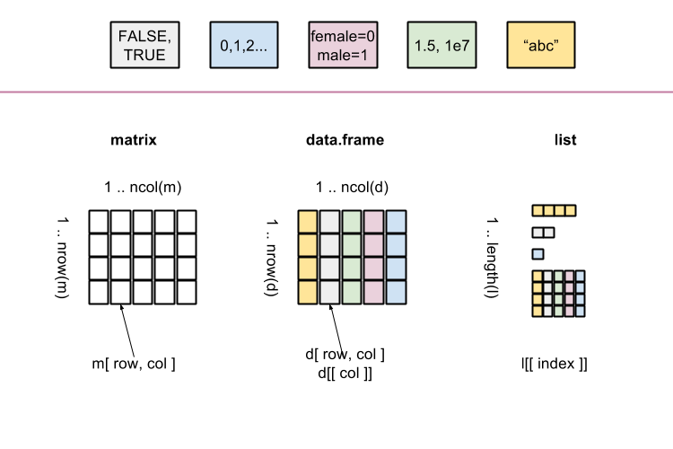

# Data types, part 2

## R scripts and reports (Rmarkdown)

### Markdown : R code + Markdown text formating language

With RMarkdown you can combine text, scripts and results. This makes it easy to organize projects.

- RMarkdown ([cheat sheet](https://www.rstudio.com/wp-content/uploads/2015/02/rmarkdown-cheatsheet.pdf)) is a simple language for creating professional reports

An RMarkdown document includes your R code output. Use to:

  - share your data analysis with colleagues
  - document your data analysis for future generations
  
The RMarkdown report can be exported in various formats: `html`, `pdf` and  `word`


#### Short session

  - Opening a new RMarkdown file
    - From RStudio  File -> New File -> R Markdown
    - Choose title and output format, choose `html` (default) here and press OK.
  - Knitting (compiling R Markdown) 
    - New RMarkdown file contains example text and code generated for you.
    - To knit, press the `knit` button in Rstudio, or use the shortcut `CTRL`+`Shift`+`k`. It first asks you to save your file. Your file will by default get extension `.Rmd`
    
Quick exercises : Review the RMarkdown with the html produced. What did RMarkdown do?


### Features of R Markdown

#### Markdown examples

Use 

  - two spaces at the end of a line for new paragraph (newline)
  - hash (`#`) for section titles. 
  - dash (`-`) for bullet lists.
  - \*italic\*, \*\*bold\*\* and \~\~strike through\~\~ for  *italic*, **bold**, ~~strike through~~ respectively
  - \> to highlight 
  
> to highlight

#### Including R code in markdown

R code is included in a `chunk`:

<pre><code>```{r}
x <- 5
x + 10
```</code></pre>

```{r}
x <- 5
x + 10
```


#### Chunk options

There are many chunck options available, most common being `echo`, `eval`. For example the option results='hide' prevents the result of the `x + 10` being included in this page:  

<pre><code>```{r results='hide'}
x <- 5
x + 10
```</code></pre>

```{r results='hide'}
x <- 5
x + 10
```

And with plots

<pre><code>```{r results='hide'}
with(infert, hist(age))
```</code></pre>

```{r echo=FALSE}
with(infert, hist(age))
```

#### R Studio and RMarkdown

- RMarkdown is well integrated with RStudio.
- By pressing `knit` a new R session is started and terminated after generating the report.
- This stand-alone nature helps to make sure that your analysis is ***reproducible***.
- The working directory of the markdown R session is the location of the markdown document.
- The knitting R session is independent from the R session in the RStudio console, this means that:
  - All data  needed for the generation of the report must be loaded/created by the scripts in the R Markdown document.
  - and conversely no data from R session in the R Studio console is accessible by the R session started for knitting. 
- It is possible to run a block of R code from R Markdown document inside the R Studio console.
- etc.


#### Try this!

From now on, work only with RMarkdown for this course.

## Lists

### What is a list

A [list](http://cran.r-project.org/doc/manuals/r-release/R-lang.html#List-objects) can be thought of as zero or more (named) cells containing data of _any type_.

Elements may be named.

Elements are accessed through indexing operations.

<center></center>

### Creation


```{r}
study <- list(            # here = or <-
  name = "Bob",           # but here only =
  age = 44,               # never <-
  children = c( "Amy", "Dan", "Eve" )
)
study
```

The class of `study`:
```{r}
class( study )
```

Function `str` gives a compact display of an object structure/content:
```{r}
str( study )
```

### Length

Length of the list (number of elements):
```{r}
length( study )
```

### Getting names of the elements

```{r}
names( study )
```

### Getting a single element

Single elements can be accessed by their names in the list:
```{r}
study$age
study[[ "age" ]]
```
Note the double [[.

The type of the returned element depends on the element:
```{r}
class( study$age )
class( study$children )
```

Nonexisting elements will give `NULL` 

```{r}
study$parents
```

It is also possible to access elements by numerical index:
```{r}
study[[ 2 ]]
```

```{r results="asis", echo=FALSE, comment=""}
catLinkTaskSection( "createList", "01_lists.Rmd" );
```

### (*) Getting multiple elements as a list 

To get (possibly) multiple elements use single brackets notation:
```{r}
study[ c( "age", "children" ) ]
```

Note the difference:
```{r}
study[[ "age" ]]
study[ "age" ]
class( study[[ "age" ]] )
class( study[ "age" ] )
```

Accessing nonexisting elements with single brackets:
```{r}
study[ "parents" ]
class( study[ "parents" ] )
names( study[ "parents" ] )
is.null( study[ "parents" ] )
```

Numerical or logical indices may be also used:
```{r}
study[ c( 3, 1, 1 ) ]
study[ c( T, F, T ) ]
```

### (*) Removing an element 

A list element is removed by setting to NULL:
```{r}
str( study )
study[[ "children" ]] <- NULL;   # NULL means "nothing"
str( study )
```

### (*) Adding an element 

```{r}
str( study )
study$gender <- "male"
str( study )
```

```{r results="asis", echo=FALSE, comment=""}
catLinkTaskSection( "elementsList", "01_lists.Rmd" );
```

## Basic statistical tests


```{r eval=1:2, echo=3:4}
pulse <- read.delim("data/pulse.txt")
survey <- read.delim("data/survey.txt")
pulse <- read.delim("pulse.txt")
survey <- read.delim("survey.txt")
```


### Statistical methods with R

Statistical methods typically have their own pre-defined functions. Example: the t-test.

#### Statistical tests - the t test

Suppose we are interested in finding a difference between `pulse1` and `pulse2` in the pulse data. These are two variables representing measurements per individual before (pulse1) and after (pulse2) an intervention. As such, measurements are paired so we apply a paired t test:

```{r}
t.test(pulse$pulse1, pulse$pulse2, paired=TRUE)
```


#### Accessing the result

The output on the screen is clear. But sometimes we want to extract parts of the output, say to put in a report, without having to include the entire output of the test. To do that, let us first save the result as an R object, and then check what it contains by using names().

```{r}
res <- t.test(pulse$pulse1, pulse$pulse2, paired=TRUE)
names(res)
class(res)
```

Note that the resulting object of `t.test` is a special type of object. It contains various components, including `r names(res)[1]` and `r names(res)[2]`. Each can be assessed by using a `$` sign, as in:

```{r}
res$statistic
res$p.value
```

Note in particular that elements in this result involve different types and lengths. Indeed:

```{r}
class(res$p.value)
class(res$alternative)
length(res$p.value)
length(res$conf.int)
```

This means that the object resulting from the t.test function is a list too.


#### Wilcoxon test

Similarly to what we did above, we can apply a Wilcoxon test for these paired measurements and save results as an object. This can be done using:

```{r}
res <- wilcox.test(pulse$pulse1, pulse$pulse2, paired=TRUE)
```


Note that the syntax is the same as the one used for the t test. 

We can also assess names and the class of the object created by the Wilcoxon test:

```{r}
names(res)
class(res)
```

Note that the class of the object created by the wilcox.test function is the same as that for the object created by the t.test function.

#### Other statistical tests

Other basic tests available include:

- `chisq.test`
- `fisher.test`
- `binom.test`


```{r results="asis", echo=FALSE, comment=""}
catLinkTaskSection( "S3", "02_S3_objects.Rmd" )
```


## Regression and formula objects


```{r echo=FALSE}
pulse <- read.delim("data/pulse.txt")
survey <- read.delim("data/survey.txt")
```


###  Formula objects

Formula objects are the way to tell R that one variable depends on another. 

#### Basics of formula objects

To specify a (statistical) model in which `y` depends on `x`, say


```{r}
y ~ x
```

We use a formula for more readable specification of code. For example, when plotting. Instead of

```{r}
plot(pulse$pulse1, pulse$pulse2)
```

we say


```{r}
plot(pulse2 ~ pulse1, data=pulse)
```

Note the reverse order!

If a function allows a formula as input it always has a `data` argument. This gives the data.frame (or other environment) in which the variables in the formula are interpreted.


#### Use of formula objects in statistics

Formula objects can also be used in the syntax of tests and other functions, making them simpler. For example, consider the problem of comparing values of `pulse1` between males and females. We can use an unpaired t test for this, by writing:


```{r}
pulse1.male <- pulse$pulse1[survey$gender == 'male']
pulse1.female <- pulse$pulse1[survey$gender == 'female']
t.test(pulse1.male, pulse1.female)
```

A much simpler way is to use a formula:


```{r}
t.test(pulse1 ~ gender, data = pulse)
```

Many functions allow (or require!) formula as input.


#### (*) The formula class

A formula is just a R object.

```{r}
class(y~x)
```

It can be stored in a variable and reused.

```{r}
form <- pulse1 ~ gender
t.test(form, data=pulse)
```


```{r results="asis", echo=FALSE, comment=""}
catLinkTaskSection( "formula", "03_regression.Rmd" );
```


### Simple linear regression

#### The `lm` function

The command for linear regression is `lm` (for *linear model*). The linear model returns an object of class `lm`.

```{r}
fit <- lm(weight ~ height, data = pulse)
```

The output of `lm` is an object of class `lm`. 


```{r}
fit
names(fit)
```

Some S3 objects have special functions defined for them. The following functions extract useful information from the `lm` object.

```{r}
summary(fit)
coef(fit)
residuals(fit)
fitted.values(fit)
```

Note that `summary(fit)` returns itself an object in which some additional things are calculated.

```{r}
summa <- summary(fit)
class(summa)
names(summa)
```

Most useful is the regression table

```{r}
coef(summa)
```

and the confidence intervals for all or some regression coefficients

```{r}
confint(fit)
confint(fit, "height")
```


####  Visualizing a regression 

We can easily visualize the regression using the same formula and fit object

```{r}
plot(weight ~ height, data=pulse)
abline(coef(fit))
```


```{r results="asis", echo=FALSE, comment=""}
catLinkTaskSection( "lm", "03_regression.Rmd" );
```


### Multiple regression and prediction

#### Multiple terms in a formula

We can have multiple terms in a formula. This way we can do multiple regression

```{r}
fit <- lm(pulse2 ~ pulse1 + height, data=pulse)
fit
summary(fit)
```


#### Predicting

We can use regression for prediction using the predict function. To predict we need two things. First, a fitted model object.

```{r}
fit <- lm(pulse2 ~ pulse1 + height, data=pulse)
```

Second, a data.frame with new data for our covariates

```{r}
new.data <- data.frame(pulse1=c(90, 80), height=c(c(173, 185)))
```

Now we can predict a value for a person with these covariates

```{r}
predict(fit, new.data)
```


#### (*) Interaction

Specifying interactions between variables in a formula: use `:` or `*`:

- `:` interaction only
- `*` interaction and main effects

Let us say that we want to explain `pulse2` by `pulse1`, `exercise` and `alcohol`, as well as a variable representing an interaction between `exercise` and `alcohol`. Two alternative ways of specifying the same model are

```{r}
lm(pulse2 ~ pulse1 + exercise + alcohol + exercise:alcohol, data=pulse)
lm(pulse2 ~ pulse1 + exercise*alcohol, data=pulse)
```


#### (*) The intercept term

We see that R automatically adds an intercept term to the model. You can suppress the intercept too, by adding either `+0` or `-1` to the formula. Suppressing the intercept has different effects if there are factor variables in your model or not. 

Suppression of the intercept means regression through the origin

```{r}
lm(weight ~ 0 + height, data=pulse)
```

Note that this is different if we have factors (see next part)!

```{r results="asis", echo=FALSE, comment=""}
catLinkTaskSection( "multiple", "03_regression.Rmd" );
```

## Factors (advanced)

### Factors revisited

We have seen an introduction to factors in the section 'Basic data types'. Remember that they are variables that define categories. We can find out the category names involved using `levels` and tabulate factors:

```{r}
levels(pulse$exercise)
table(pulse$exercise)
```

Note that the category names given by its levels come typically in alphabetical order. In the example above, this order does not correspond to the intrinsic order of the categories, in which the extremes are given by `high` and `low`, with `intermediate` in the middle, rather than the last one. This is not a big problem for a table, but it is not ideal for a graph. Indeed, a boxplot of `pulse2` according to the groups defined by `exercise`  looks like:

```{r}
boxplot(pulse$pulse2 ~ pulse$exercise)
```

So we would like to re-order the factor levels so that they correspond to the intrinsic order of the categories.

#### Reordering a factor

To change the order of the category levels, we create the factor again by giving its levels in the correct order:

```{r}
pulse$exercise <- factor(pulse$exercise, levels=c('high', 'moderate', 'low'))
```

We can check that the re-ordering has worked:

```{r}
levels(pulse$exercise)
table(pulse$exercise)
boxplot(pulse$pulse2 ~ pulse$exercise)
```


#### Changing factor labels

If you want to change the category labels only, without re-ordering them, assign new values to the `levels` of a factor.

```{r}
pulse$exercise2 <- pulse$exercise
levels(pulse$exercise2) <- c("H", "I", "L")
table(pulse$exercise2)
```


We can use similar code to merge categories of a factor. For example, to merge the categories `H` and `I`, assign to them the same label:

```{r}
pulse$exercise3 <- pulse$exercise
levels(pulse$exercise3) <- c("H.I", "H.I" , "L")
```


#### Turning a continuous variable into categories

Use `cut` to categorise a continuous variable and turn into a factor variable. Note that when calling `cut` the break points between categories need to be given, including the maximum and minimum values of the original variable.

```{r}
pulse$height4 <- cut(pulse$height, c(min(pulse$height)-1, 160, 170, 180, max(pulse$height)))
class(pulse$height4)
table(pulse$height4)
```


You may want to change the labels to something prettier.

```{r}
levels(pulse$height4) <- c('-160', '160-170', '170-180', '180+')
table(pulse$height4)
```


#### (*) Combining factors

The `:` operator can be used to make a new factor with all combinations of two (or more) factors

```{r}
#pulse$smokes:pulse$alcohol
```


```{r results="asis", echo=FALSE, comment=""}
catLinkTaskSection( "levels", "04_advanced_factors.Rmd" );
```


### ANOVA and regression with factors

An ANOVA analysis can be run in R by using the results of a regression model fit, such as from `lm`.

#### Regression model fit

Say you fit a regression model of `pulse2` on `exercise`, which already had its categories reordered:


```{r}
table(pulse$exercise)
fit <- lm(pulse2 ~ exercise, data=pulse)
summary(fit)
```

In the results, `exercisemoderate` represents the effect of `exercise='moderate'` versus the reference category `exercise='high'`. By default, the first level of the factor is taken as the reference category, and this is often the first level in alphabetical order. 

The model fit above yields tests per category of `exercise`, compared with the reference category. However, a test for the effect of the entire variable `exercise` is not directly available. This can be obtained with ANOVA (Analysis of Variance).

#### The ANOVA table and F-test

The ANOVA table can be obtained by using the function `anova` and the model fit `fit`:

```{r}
anova(fit)
```

We can also compare two model fits using ANOVA. Say that we want to check if the above model fit improves by including `gender` in the model. Then we fit a model with both `exercise` and `gender`, and compare this new fit with the above one:

```{r}
fit2 <- lm(pulse2 ~ exercise + gender, data=pulse)
anova(fit, fit2)
```


Note that `lm` by default removes any subjects which have missing values in at least one of the covariates. This means that the number of subjects in `fit` and `fit0` may be different and error returned. In that case remove subjects with missing values manually (or do imputation or something more fancy).


#### (*) Model fit without a reference category

When fitting a regression model, we can do without a reference category in a model fit by suppressing the intercept:

```{r}
lm(pulse2 ~ 0 + gender, data=pulse)
```

The coefficient now represents the mean in the group (male or female), instead of a comparison between males and females (such a comparison is called a contrast).

Note that the reference category is only suppressed for the first factor in the formula:

```{r}
lm(pulse2 ~ 0 + gender + ran, data=pulse)
```

Note that suppressing the intercept has a different effect for explanatory factors and for continuous explanatory variables.


### (*) Generalized linear models and survival

Regression models can be run using the function `glm` (generalized linear model), which has very similar syntax to `lm`. Amongst useful models are logistic models.

#### (*) Logistic regression and ANOVA

For logistic regression, use `glm`  with slot `family=binomial`.

```{r,eval=-1}
fit <- glm(alcohol ~ gender + smokes + exercise, family=binomial, data=pulse)
summary(fit)
```

When using `anova` in `glm`, the default is not to give a p-value. If you want it, explicitly ask for one. In case of the logistic model, the adequate way to compute the ANOVA p-value is via the likelihood ratio test (LRT):

```{r}
anova(fit, test='LRT')
```


#### (*) Survival analysis

Survival analysis methods are available in the `survival` package, which is installed automatically with the base package. The syntax is similar to `lm` and `glm`, except that the response has to be a `Surv` object, built from two separate variables giving time and event.

We do not have survival times in the `pulse` data, so we use the `aml` data from the `survival` package.

```{r,eval=-2}
library(survival)
?aml
with(aml, Surv(time, status))
```

To draw Kaplan-Meier curves, use `survfit`:

```{r}
fit <- survfit(Surv(time, status) ~ x, data=aml)
plot(fit, col=2:3)
```


A log-rank test can be computed using:


```{r}
survdiff(Surv(time, status) ~ x, data=aml)
```

A Cox model can be fitted as follows:

```{r}
coxph(Surv(time, status) ~ x, data=aml)
```


As before, each object can be stored separately. In particular, the Surv object can be saved and the entire analysis run using it. 

The result of coxph can be stored as an object and manipulated in most ways like a `lm` or `glm` object. In particular we can use `anova` to compare different model fits.


```{r results="asis", echo=FALSE, comment=""}
catLinkTaskSection( "anova", "04_advanced_factors.Rmd" )
```


